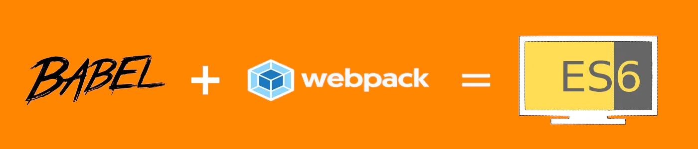

## Creating a web application using ES6 for both code and configuration using Webpack 4 and Babel 7 for bundling

> 	**Background:** Using Webpack with Babel to bundle ES6 web application is a well documented area with pieces of supporting content in various sources like StackOverflow and Git providing information on how to use ES6 for the Webpack config file. But Babel started using scope packages starting from version 7. Since a lot of documentation was written for Babel 6 but not Babel 7. This caused a fair amount of confusion to many developers (Author included). Since many OpenSource packages tend to be to occupied with their own repository to be able to provide full time support or update the documentation. This article hopes to fill up that gap till all the various packages move their versions up.

*Prerequisites: This article presumes that the reader has an understanding behind the choice of using Webpack, Babel and ES6 for web applications. It also assumes a basic understanding of how to use Webpack, Babel and ES6.*

This article uses a demo web application that does nothing but simple javascript to write to the browser DOM. It does not go into the detail of configuring various Webpack plugins or Babel plugins for complex applications like SPAs. The source for the application can be located at Github repo [es6-webpack4-babel7](https://github.com/seetdev-opensource/es6-webpack4-babel7).

The following sections detail the actions carried out to create this application. The application starts with the following tree:

```console
.
├── LICENSE - MIT License file for the repository
├── README.md - File describing the repository
├── package.json - Configuration file for npm package
└── src - Folder containing all the application files
    ├── Controller.js
    ├── index.js
    └── index.template.html
```

**Step 1**

In the root folder of the application, we run the following command `npm install --save-dev webpack webpack-cli`. This will install the `webpack` which contains the code for the bundling operations and `webpack-cli` which provides the command line access for Webpack. We passed the option `--save-dev` to indicate that we want `npm` to save these packages as a development dependency in `package.json`

**Step 2**

Next since the Webpack packages are not installed into the global `node_module`, a simple modification is required for `package.json` that will allow this to run the locally installed `webpack-cli`. This uses `npx` package that is available only from `npm` version 5.2.0 onwards. npx allows us to run the task `npm run build` which executes Webpack after adding a new property `“build”: “webpack”` to the scripts property in `package.json`. For npm version < 5.2.0 please refer to footnotes[^1].

**Step 3**

This step installs the minimal packages required for Babel 7 to work with Webpack for a web application. In the event, versions > then those in the article introduces breaking changes this article will be updated whenever possible. First run npm install --save-dev babel-loader @babel/core @babel/preset-env html-webpack-plugin script-ext-html-webpack-plugin in the terminal. The following packages will be installed as development dependencies since the packages will not be used in runtime.

1. `@babel/core` — This is the engine that will pick up all the configuration provided to run plugins to transpile the latest version of JavaScript through syntax transformers into plain vanilla versions supported by the target platform. Notice that this uses `@babel/` which means it is a scope package[^2].
2. `@babel/preset-env` — This scope package is a Babel preset that compiles code down to ES5 by automatically determining the Babel plugins and polyfills needed based on the targeted browser or runtime environments. By default it behaves exactly the same as babel-preset-latest (or babel-preset-es2015, babel-preset-es2016, and babel-preset-es2017 together)[^3].
3. `babel-loader` — This is the Babel plugin for Webpack, it will be added to the Webpack configuration to instruct it to run the target files though Babel during the bundling process. Note that it is not using scope packages.
4. `html-webpack-plugin` — This is a Webpack plugin that simplifies creation of HTML files to serve your webpack bundles. This is especially useful for webpack bundles that include a hash in the filename which changes every compilation. You can either let the plugin generate an HTML file for you, supply your own template using [lodash templates](https://lodash.com/docs#template), or use your own [loader](https://webpack.js.org/loaders/).
5. `script-ext-html-webpack-plugin` — This is a Webpack plugin which is not really required by the bare minimal setup as well. But it allows the automation of injecting the bundled javascript into the HTML files that is included in the distribution

**Step 4**

In this step the package to allow the Webpack configuration file to be written using ES6 is installed. Run `npm install --save-dev @babel/register` in the terminal. The following packages will be installed as development dependencies since the packages will not be used in runtime.

1. `@babel/register` — This scope package provides the require hook that will bind itself to node’s `require` and automatically compile files on the fly for Babel. Webpack uses `js-interpret`[^4] internally to call register the package as a module to transpile the Webpack configuration file for execution. It requires the file to be named with a `.babel.js` suffix to work.

**Step 5**

The final step creates the Webpack configuration file `webpack.config.babel.js` used to configure Webpack. The full details of the configuration file will not be covered here[^5]. But in short it gets the entry javascript file provided and processes it through the modules. It uses plugins to make sure the html is processed as well. The important thing to note is the file is named with a prefix `webpack.config` which is part of the default filename use by Webpack. It also uses the suffix `babel.js` that is used by `js-interpret` to identify configuration files that needs to be transpiled by Babel.

```js
import path from 'path';
import HtmlWebpackPlugin from 'html-webpack-plugin';
import ScriptExtHtmlWebpackPlugin from 'script-ext-html-webpack-plugin';
export default {
    entry: path.join(__dirname, 'src/index.js'),
    output: {
        path: path.join(__dirname, 'dist'),
        filename: '[name].bundle.js'
    },
    module: {
        rules: [{
            test: /\.js/,
            exclude: /(node_modules|bower_components)/,
            use: [{
                loader: 'babel-loader'
            }]
        }]
    },
    plugins: [
        new HtmlWebpackPlugin({
            title: 'Custom template',
            template: path.join(__dirname, 'src/index.template.html')
        }),
        new ScriptExtHtmlWebpackPlugin({
            defaultAttribute: 'defer'
        })
    ],
    stats: {
        colors: true
    },
    devtool: 'source-map'
};
```

**Step 6**

In the final step, a configuration file is created for Babel `.babelrc`. This is the default file name used by Babel for defining the configuration during the Babel transpilation process.

```json
{
    "presets": ["@babel/preset-env"]
}
```

**Final Step**

With all the setup done, this will be the final directory tree of the project. (`node_modules` has been ignored to keep this concise)

```console
.
├── LICENSE
├── README.md
├── package-lock.json
├── package.json
├── src
│   ├── Controller.js
│   ├── index.js
│   └── index.template.html
└── webpack.config.babel.js
```

The command `npm run build` can be ran in the root folder that will generated the bundled Javascript file and generated html file in the dist folder detailed in the configuration.

### Conclusion

This article provides a simple implementation of how setup Webpack to use Babel 7 for both the configuration of Webpack itself and also the bundling of code using ES6. It does not cover all the use cases of Webpack or Babel with the hope that it provides a basic understanding of these tools that can be expanded by the reader. The companion code used can be found at https://github.com/seetdev-opensource/es6-webpack4-babel7. And the following shows the list of dependencies and their versions that has been tested against for this article.

```json
"devDependencies": {
  "@babel/core": "7.2.2",
  "@babel/preset-env": "7.3.1",
  "@babel/register": "7.0.0",
  "babel-loader": "8.0.5",
  "html-webpack-plugin": "3.2.0",
  "script-ext-html-webpack-plugin": "2.1.3",
  "webpack": "4.29.3",
  "webpack-cli": "3.2.3"
}
```

Suggestions or fixes to the article to make it more useful for everyone will be welcomed. But the author is not doing this full time so response might take time.

[^1]: For npm version < 5.2.0, there is a choice of installing Webpack globally, use the full path in `node_modules` to the binary of Webpack installed or looking into the references provided in https://github.com/npm/npm/releases/tag/v5.2.0 to run `npx` on the command line.

[^2]: Scopes are a way of grouping related packages together, and also affect a few things about the way npm treats the package https://docs.npmjs.com/misc/scope

[^3]: Babel does not recommend using `preset-env` using the default settings because it doesn’t take advantage of it’s greater capabilities of targeting specific browsers. But this is a topic that is out of scope for this article and you can refer to https://babeljs.io/docs/plugins/preset-env/ for more information.

[^4]: js-interpret a package used by Webpack to to automatically require dependencies for configuration files https://github.com/js-cli/js-interpret

[^5]: Full details on how the Webpack configuration file works can be found at the documentation https://webpack.js.org/configuration/