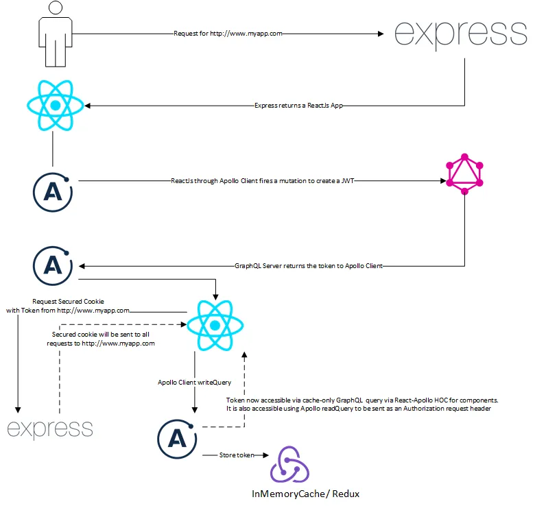

## Creating a authentication mechanism with the cache and secured cookies

> 	**Background:** In this article, we are going to explore how authentication can be done in an application build using React, Apollo Client and GraphQL. This is an opinionated way to do Authentication without using a Third Party Provider. It is not necessary the most robust or secured method. But it will be a good POC for anyone who wishes to to their own Authentication.

*Prerequisites: This article presumes basic knowledge of React, Apollo Stack and GraphQL*

Authentication in an application involves the presenting of a set of credentials from the client to the server to prove the identity of the user. Upon verification of the correct credentials, the server will usually issued a token or an identity of some form that the client can present to the server from future requests.

Traditionally, this identity has been stored in a session cookies that are be transmitted to the server for every requests. And the newer approach has been the use of JSON Web Tokens (JWT). The comparison of the 2 methods have been heavily debated and there is a great article by Auth0 on the benefit of the latter in https://auth0.com/blog/angularjs-authentication-with-cookies-vs-token/.

When Building Apps with React, Apollo Client and GraphQL authentication can be done in the following flow. The ReactJs App can send the credentials through the Apollo Client to GraphQL which returns a JWT. This JWT can be stored into SessionStorage or LocalStorage by that can then be sent as part future requests for verifying the identity of the requester.

<figure>
    
    <figcaption>How authentication can be done using GraphQL</figcaption>
</figure>

This approach has a couple of disadvantages.

1. Apollo Client or the React App now needs to read from Session Storage or Local Storage to get the Token
2. No support for persistent login on First Load using SSR

We are going to look into a different approach to accomplish the same authentication using some tricks made possible by Apollo Client’s readQuery and writeQuery to make the creation of Authorization Request Headers easiler. We will also be looking to use bring back the dreaded Cookies while removing its flaws though using features like HttpOnly, disallowing sub domains, and signing it to make it more secure. We will be using Cookies as a storage medium for the JWT and not Session Cookies it will not have the scalability issue. In return it will provide us the ability to give the user a better experience since SSR will know about their persistent login during First Load. This could be done as Cookies are sent by the browser during the request unlike SessionStorage or LocalStorage which requires a script to send the values.

<figure>
    
    <figcaption>Authentication with GraphQL using secured cookies and InMemory Cache</figcaption>
</figure>

This new approach follows the same flow as the previous approach till the GraphQL server returns the token. The React App upon receiving the token will trigger 2 actions. First it will do an Apollo Client writeQuery which will place the token in the In Memory cache making it available to the React App through the Apollo Client. Lastly if the token should be persisted across sessions, the React App will request a secured cookie from the Server (Example: http://www.myapp.com) that serves the React App using the token. The Server should return a signed, HttpOnly cookie with the requested expiry date that is restricted to the domain. This signed cookie will always be sent to the server during page requests even in future versions. The Server Side Rendering code for the React App will now be able to read the signed cookie if it has not expired and issue a Apollo Client writeQuery on the Server. This will return a React App with an initial cache state containing the token.

### Implementation

This section provides code sections of how to implement the solution. We will be discussing only the sections that are crucial to the solution. The full solution can be obtained from https://github.com/seetdev-opensource/react-apollo-auth.

To test the solution you can issue by executing the the following commands in a terminal

```console
git clone git@github.com:seetdev-opensource/react-apollo-auth.git
cd react-apollo-auth
npm install
npm run devServer
```

### Versioning

The dependencies of the solution have tested and fixed at the versions listed:

```json
"devDependencies": {
  "@babel/core": "7.2.2",
  "@babel/node": "7.2.2",
  "@babel/plugin-proposal-class-properties": "7.3.0",
  "@babel/preset-env": "7.3.1",
  "@babel/preset-react": "7.0.0",
  "@babel/register": "7.0.0",
  "babel-loader": "8.0.5",
  "webpack": "4.29.3",
  "webpack-cli": "3.2.3"
},
"dependencies": {
  "@babel/polyfill": "7.2.5",
  "apollo-cache-inmemory": "1.4.2",
  "apollo-client": "2.4.12",
  "apollo-link": "1.2.8",
  "apollo-link-error": "1.1.7",
  "apollo-link-http": "1.5.11",
  "apollo-server-express": "2.4.0",
  "body-parser": "1.18.3",
  "cookies": "0.7.3",
  "express": "4.16.4",
  "graphql": "14.1.1",
  "graphql-tag": "2.10.1",
  "isomorphic-fetch": "2.2.1",
  "jsonwebtoken": "8.4.0",
  "prop-types": "15.6.2",
  "react": "16.8.1",
  "react-apollo": "2.4.1",
  "react-dom": "16.8.1",
  "react-router": "4.3.1",
  "react-router-config": "4.4.0-beta.6",
  "react-router-dom": "4.3.1"
}
```

### Folder Structure

The project is build using some of the new ES6/ ES7 syntax and requires Babel to transpile the code before execution. The folder structure with key folders and files is as follows:

```console
- react-apollo-auth
  |_src
  | |_client     
  | | |_assets   
  | |_graphql
  |__.babelrc
  |__webpack.config.babel.js
```

#### src

The src folder contains the code files used for the entire solution. It contains the following files

```console
- constant.js: Constant variables used in  the app
- data-client.js: Helper methods to create the Apollo Client and required Links
- index.js: Code file containing implementation of the Express server.
- renderEngine.js: Code file to perform the server side rendering (SSR) for the React app
- routes.js: Code file for defining the React Router routes.
```

##### index.js

To implement the solution the Express server needs to implement the following middle ware:

***Cookie Handling Middleware***

This uses the npm package cookies to expose a cookies property on the Express req to allow Get and Set cookie methods during a HTTP request.

```js
// Make cookies a property of req to allow easy setting and getting of cookies  
app.use(
  (req, res, next) => {
        const options = { keys: [COOKIE_SECRET_KEY] };      
        req.cookies = new Cookies(req, res, options);    
        next();
  }
);
```

***GraphQL***

This article uses Apollo Server 2 which provides a simpler syntax that hooks up the GraphQL implementation on the endpoint ‘/graphql’. We are putting this in the same Express implementation to make it simple for this article. It also ships with GraphQL Playground instead of GraphiQL and collocates the GUI with the endpoint. It requires the type definition and resolver instances to create the server.

```js
const server = new ApolloServer({ typeDefs, resolvers });
server.applyMiddleware({ app });
```

***React SSR Middleware***

This hooks up the rendering engine for the React App that will respond to HTTP requests for the client application

```js
app.use((req, res, next) => renderEngine()(req, res, next));
```

In addition the Express server needs to expose the following Endpoints to handle the cookies

- POST /credentialCookie

This endpoint allows the React App to request the server to set a secure cookie. For demonstration purpose the code set an expiry date and signs the cookie. The npm cookies package also sets the HTTPOnly flag which ends an indication to the browser that this cookie is only supposed to be accessed by the server if the feature is supported. There are other settings like Domain, Path or Secure that can be used.

```js
app.post(
  '/credentialCookie', (req, res) => {
    let currentDate = new Date(); 
    currentDate.setDate(
      currentDate.getDate() + req.body.expiryInDays
    );
    req.cookies.set(
      COOKIE_KEY,
      req.body.token, { signed: true, expires: currentDate }
    );    
    res.send('OK').end();
  }
);
```

- DELETE /credentialCookie

This endpoint allows the React App to request the server to delete the cookie when the user executes the Sign out action in the client

```js
app.delete(
  '/credentialCookie',
  (req, res) => {
    req.cookies.set(COOKIE_KEY);
    res.send('OK').end();
  }
);
```

##### renderEngine.js

The renderEngine middleware performs the Server Side Rendering (SSR) that obtains the required initial state for the requested Components and serializes it for the response to the client.

The engine reads the JWT from the cookie and writes it into the In Memory store that provides the initial state for the response. It uses the Apollo Client writeQuery call since this state will be available only from the cache on the client. Once the response is render on the client browser, all future calls on currentCredentialQuery will hit the cache without calling the GraphQL server. This is done using the following code.

```js
// This obtains the authentication credential from the signed cookie      const token = req.cookies.get(COOKIE_KEY, { signed: true }) || '';      let decoded = null;
try {
  decoded = await jwt.verify(token, JWT_SECRET_KEY);
} catch(err) {
  decoded = { email: '', name: '' };
}       
const credential = {
  ...decoded, token, __typename: 'Credential'
};       
// Populate the store with the initial state of authentication during SSR      
client.writeQuery({
  query: currentCredentialQuery, data: { credential }
});
```

##### routes.js

The route.js file hooks up the HOCs to the components that are rendered per requested route. The GraphQL query HOCs getStatus, getCurrentCredential and GraphQL mutation createCredential are hooked up to each component in this file.

```js
export default () => [
  {
    component: compose(
      getStatus, getCurrentCredential
    ) (withRouter(App))
    , routes: [
      {
        path: '/', exact: true
        , component: getCurrentCredential(withRouter(Home))
      }
      , {
        path: '/login'
        , component: withApollo(createCredential(withRouter(Login)))
      }
      , {
        path: '/logout', component: withApollo(withRouter(Logout))
      }    
    ]
}];
```

#### src/client

The src/client folder contains the code files used for the React components. It contains the following files

```console
- app.js: App component that is rendered on all paths requested. It receives property variables from GraphQL queries that is used for rendering.
- home.js: Component rendered on the default path. It provides action buttons to navigate to the Login or Logout components that is rendered based on the login status.
- index.js: Code file that provides the rendering of the entire client side component tree.
- login.js: Component that provides the login functionality. It uses the createClient mutation and Apollo Client to provide the credential in the store when the user logs in to the application.
- logout.js: Component that provides the logout functionality. It uses the Apollo Client to clear the credential in the store when the user logs out off the application and refetches the queries impacted by the credential changed.
- query.js: Code file containing the queries, mutations and related HOCs used by the components.
```

##### index.js

The code begins by creating the Apollo Client that will be used by the application to manage the InMemory cache and communication with the GraphQL server to read and write data. The InMemory cache is created with the serialized initial state from the SSR using the window variable __APOLLO_STATE__. It also uses the Apollo HTTP Link with a custom Error Link. The ErrorLink copies the error property on from the result return during a GraphQL call into the data property and clears the original property. This prevents the client from throwing errors if an error occurs while providing a way for the client to handle them (Example: format the errors for display to the user)

```js
const client = createClient(
  createInMemoryCache({ ...window.__APOLLO_STATE__ }),
  createErrorLink.concat(
    createHttpLink('http://localhost:3000/graphql')  
  ), 
  false
);
```

Then it renders the entire app with Providers that provide context properties to all child component that requests for the context providers. Note that the hydrate call is used instead of render from React. The render call is deprecated from version 16.0.

```js
hydrate(
  <BrowserRouter>
   <ApolloProvider client={client}>          
     {renderRoutes(RoutesConfig())}    
   </ApolloProvider>  
  </BrowserRouter>
  , document.getElementById('appRoot')
);
```

##### query.js

In this file, we export 3 GraphQL HOCs and 1 GraphQL query that is used by all client components. The HOCs will provide the data (queries) or action (mutation) properties in the props object of the components that it wraps.

An example of a Query HOC will be getStatus that will provide a message value that can be read by the wrapped component using the call this.props.getStatus.status.message.

```js
const statusQuery = gql(
  `
    query StatusQuery {
      status {
        message
      }
    }
  `
);

export const getStatus = graphql(statusQuery, {
  name: 'getStatus'
});
```

An example of a Mutation HOC will be createCredential that will provide an action that can be called by the wrapped component using the call this.props.createCredential.

```js
const loginMutation = gql(`
  mutation LoginMutation($email: String!) {
    createCredential(credential: {
      email: $email
    }) {
      email
      name
      token
    }
  }
`);

export const createCredential = graphql(loginMutation, {
  name: 'createCredential'
});
```

For this App a special type of GraphQL query is also provided which only reads data from the InMemory cache without calling the GraphQL Server. This is seen in getCurrentCredential which is created with a property of fetchPolicy: ‘cache-only’. The call will throw an exception if the data is not found in the cache. The query currentCredentialQuery used by the HOC is also exported since the client now needs to manipulate data in Apollo.

```js
export const currentCredentialQuery = gql(
  `
    query CurrentCredentialQuery {
      credential {
        email
        name
        token
      }
    }
  `
);

// This query should only be ran on the in memory cache on the client.
export const getCurrentCredential = graphql(currentCredentialQuery, {
  name: 'getCurrentCredential'
  , options: {
    fetchPolicy: 'cache-only'
  }
});
```

##### home.js

This component uses the getCurrentCredential to check the status of the user in order to render the correct actions.

```js
const Home = (props) => {
  const {
    history, getCurrentCredential: { credential: { token } }
  } = props;

  return (
    <div>
      {
        !token 
        && <button onClick={ () => { history.push('/login'); } }>
             Login
           </button>
      }
      {
        token
        && <button onClick={ () => { history.push('/logout'); } }>
             Sign Out
           </button>
      }
    </div>
  );
};
```

##### login.js

This component uses the createCredential mutation to obtain the credential of the user. Then it performs the operations to write the credential to both the InMemory cache and as a cookie. This is all done in the handleSubmit event handler. The InMemory cache update is done using the ApolloClient.writeQuery call while the cookie writing is done by performing an API call to the host Express server

```js
class Login extends React.Component {
  constructor(props) {
    super(props);
    this.state = {
      email: '',
      errors: []
    };
  }

  handleChange = (event) => {
    this.setState({ email: event.target.value });
  }

  handleSubmit = async (event) => {
    const { createCredential, history } = this.props;
    const { data } = await createCredential({
      variables: { email: this.state.email }
      , update: (proxy, { data }) => {
        if (data.createCredential) {
          // Write our data back to the cache, if there are no errors
          const credential = {
            ...data.createCredential
            , __typename: 'Credential'
          };

          // This writes to the in memory cache the credential obtained from the GraphQl server
          // This allows the authentication token to be found on the cache without hitting the server
          proxy.writeQuery({
            query: currentCredentialQuery
            , data: { credential }
          });
        }
      }
    })

    if (data.errors) {
      this.setState({ errors: data.errors });
      return;
    }

    const result = await fetch(`${BASE_URI}/credentialCookie`, {
      method: 'POST'
      , body: JSON.stringify({
        token: data.createCredential.token
        , expiryInDays: 1
      })
      , headers: {
        'Content-Type': 'application/json'
      }
      , credentials: 'same-origin'
    });

    history.push('/');
  }

  render() {
    return (
        <div>
          <p>
            Email: <input
              type="text"
              value={this.state.email}
              onChange={this.handleChange}
            />
          </p>
          <p>
            <input
              type="submit"
              value="Login"
              onClick={this.handleSubmit}
            />
          </p>
          {
            this.state.errors.length > 0 
            && this.state.errors.reduce(
              (item, index) => (
                <p key={index}>{item}</p>
              )
            )
          }
        </div>
    );
  }
};
```

##### logout.js

This component it performs the operations to clear the credential in both the InMemory cache and cookie store. This is all done in the componentDidMount event. The InMemory cache update is done using the ApolloClient.writeQuery call while the cookie writing is done by performing an API call to the host Express server

```js
class Logout extends React.Component {
  async componentDidMount() {
    const { client } = this.props;

    // Clear the cookie
    const result = await fetch(`${BASE_URI}/credentialCookie`, {
      method: 'DELETE'
      , headers: {
        'Content-Type': 'application/json'
      }
      , credentials: 'same-origin'
    });

    const credential = {
      name: ''
      , email: ''
      , token: ''
      , __typename: 'Credential'
    };

    // Clear the cache of the credential
    client.writeQuery({
      query: currentCredentialQuery
      , data: { credential }
    });
  }

  render() {
    const { history } = this.props;
    return (
      <div>
        <h3>You have been logged out of the system.</h3>
        <input
          type="submit"
          value="Home"
          onClick={ () => { history.push('/'); } }
        />
      </div>
    );
  }
}
```

#### src/graphql

The src/client folder contains the code files used for the GraphQL server implementation. It contains the following files

```console
- schema.js: Code file containing schema and resolvers for the GraphQL server implementation
```

##### schema.js

The GraphQL server requires a type definition object and a resolver object. This is provided in this implementation thought the typeDefs and resolvers variables.

The typeDefs will contain the types used in the schema that is declared using the type or input keywords. The input types are mainly used as variables and in our App it is used for the Mutation createCredential. The Query Type declares what queries the client and execute against this implementation. While the Mutation Type declares what actions the client and perform on this implementation.

The resolvers object provide the implementation detail of how the GraphQL is suppose to obtain the data or manipulate data if it is a Mutation. The implementation manipulates everything in memory but it is typically performed against a data store (SQL DB, NoSQL DB), APIs (Rest, Soap), Micro services, other GraphQL servers or even legacy backend systems as long as it is accessible from the GraphQL server.

```js
// Type Definition
const typeDefs = gql`
  type Status {
    message: String!
  }

  type Credential {
    token: String!
    email: String!
    name: String!
  }

  input CredentialInput {
    email: String!
  }

  type Query {
    status: Status
  }

  type Mutation {
    createCredential(credential: CredentialInput!): Credential
  }
`;

const resolvers = {
  Query: {
    status: () => {
      return {
        message: "Live"
      };
    }
  }
  , Mutation: {
    createCredential: async (root, { credential }) => {
      // This is hardcoded since it is a POC and to made the example    
      simple
      // The resolver should be by itself and there should be a 
      store to do this authentication
      if (credential.email !== 'test@test.com') {
        throw new Error('Credential validation error');
      }

      const user = {
        email: 'test@test.com'
        , name: 'Test Users'
      }

      // Signing the JWT with a common secret here hardcoded in the 
      file to keep in simple.
      const token = jwt.sign(user, JWT_SECRET_KEY);

      return {
        token
        , ...user
      };
    }
  }
};

export { typeDefs, resolvers };
```

### Conclusion

This article provides a simple implementation of how to do Authentication using a GraphQL server. Most applications will require more complex implementations although this POC could help in shaping that development. The POC does not go into the detail of populating the Authorization Request Header as there are plenty of documentation to do that both on the Apollo or React end.