> 	**Background:** This article looks into how to build a custom Virtual Machine (VM) on GCP with specific PyTorch versions and CUDA support for Deep Learning. The base OS used is Debian Linux 9 (Stretch) although Ubuntu should be similar but not tested.

GCP supports an out of the box OS Image for Deep Learning. The image is Debian based image with PyTorch 1.0.0 (CUDA 10.0) fastai, CUDA and Intel® optimized NumPy, SciPy, and scikit-learn. The image provides the easiest way to deploy a Compute Engine VM that is supported by GCP. The Python version used is Python 3.5 which is installed by default on the image.

This article provides a guide for situations where a specific version is required for PyTorch which could happen due to the following:

- Requirement to use the latest and greatest version of PyTorch
- Network to be trained on GCP but deployed to a platform that supports a lower version of PyTorch

I encountered the second use case where I was deploying to a platform that is on PyTorch 0.4.0 (Cuda 9.10) for a project submission in PyTorch Scholarship Challenge 2018/2019. I could have used some code in PyTorch to handle the difference in version. But being new to PyTorch and not knowing the tool in depth, I decide to train it using the same version as the deployment platform. The following describes the steps to perform the creation of this VM and how to use ssh tunneling to access the notebook.

### Versioning information
- Debian 9 (Stretch)
- PyTorch 0.4.0 (Cuda 9.1)
- NVIDIA Cuda 9.1
- Python 3.5
- Pip 3

### Preparation

1. Get NVIDIA binaries from the developer site https://developer.nvidia.com. An account is required to download the binaries. For this article we are downloading the CUDA 9.1 binaries since that is the highest version supported by PyTorch 0.4.0. We are getting the Ubuntu version since there are none available for Debian. It has been tested to be working without issues on Debian 9


2. Currently CUDA 9.1 has 4 files and we download all of them.
    1. cuda_9.1.85_387.26_linux.run (Base Installer)
    2. cuda_9.1.85.1_linux.run (Patch 1)
    3. cuda_9.1.85.2_linux.run (Patch 2)
    4. cuda_9.1.85.4_linux.run (Patch 4)

3. Install GCloud tools on your host. Please refer to https://cloud.google.com/sdk/docs/#install_the_latest_cloud_tools_version_cloudsdk_current_version to get the correct instructions

### Create the VM on Compute Engine

1. GCP Console click on `Compute Engine -> VM Instance` in the side drawer

<figure>
    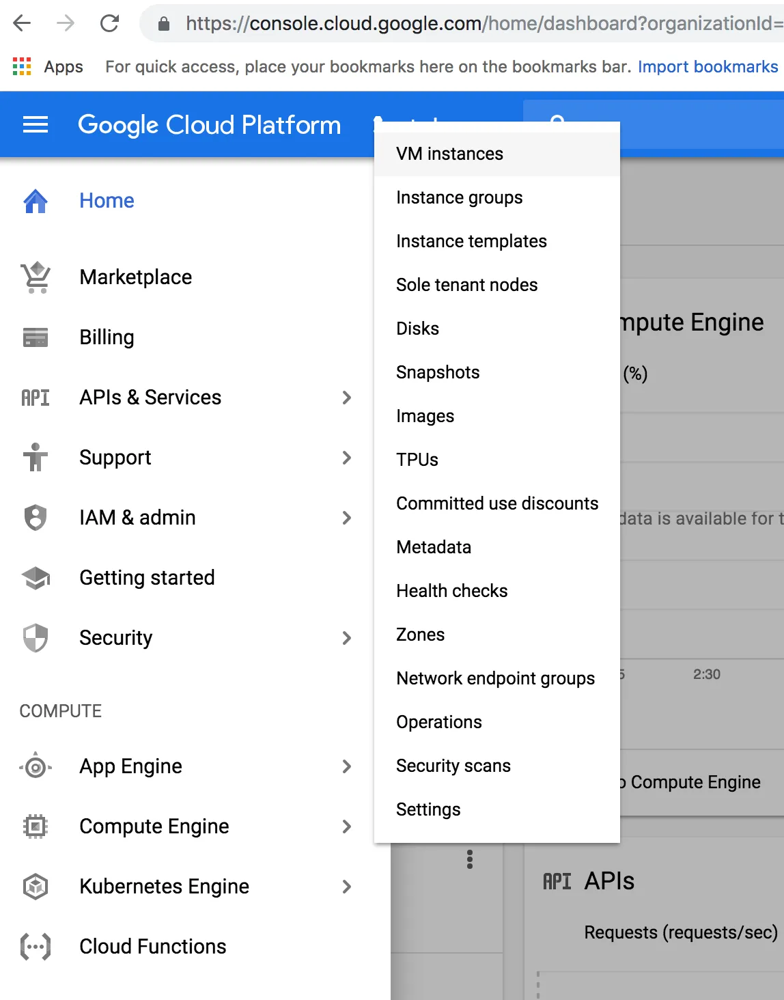
    <figcaption>GCP Console side drawer Compute Engine VM Instances</figcaption>
</figure>

2. Click on the button `Create Instance`

<figure>
    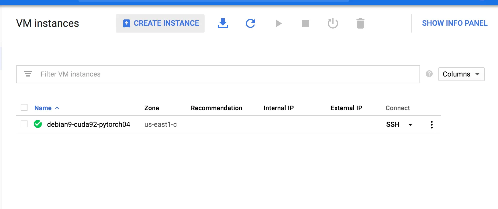
    <figcaption>VM Instances screen</figcaption>
</figure>

3. Enter the desired name for the name of the instance and select the desired Region and Zone. Refer to `https://cloud.google.com/compute/docs/gpus/` to check if your desired zone supports the GPU you need.

<figure>
    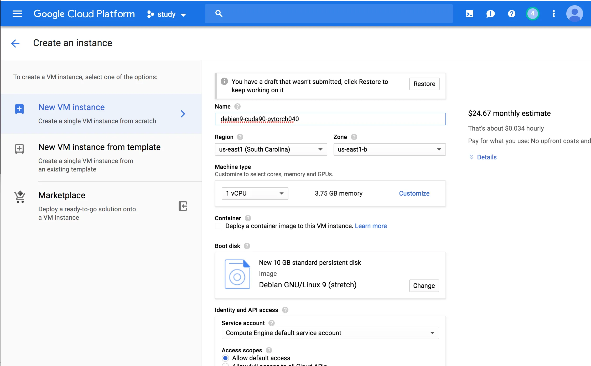
    <figcaption>VM name, region and zone</figcaption>
</figure>

4. Click on the `Customize` link under the Machine Type section. In the dialog select 1 for Number of GPUs and the GPU type

<figure>
    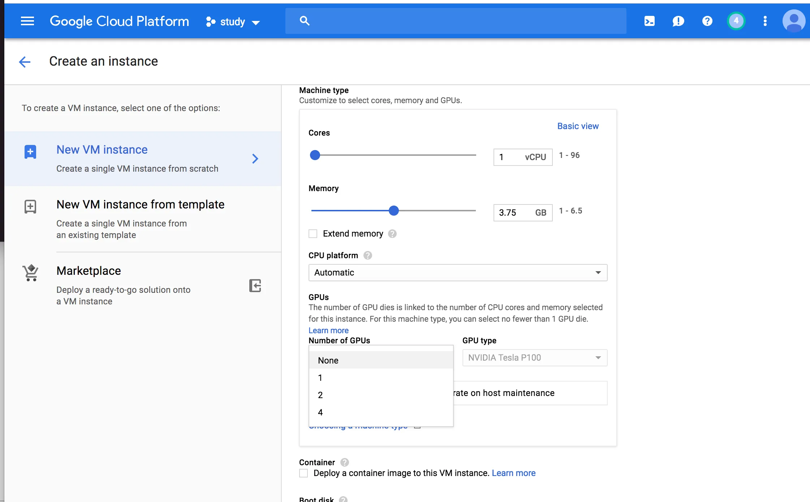
    <figcaption>VM machine type</figcaption>
</figure>

5. Click on the `Change` button in the Boot Disk section. A dialog should appear. Choose the base OS, boot disk type and the size of disk. This article uses Debian GNU/Linux 9 (stretch) with 150 GB SSD. Click on the `Select` button.

<figure>
    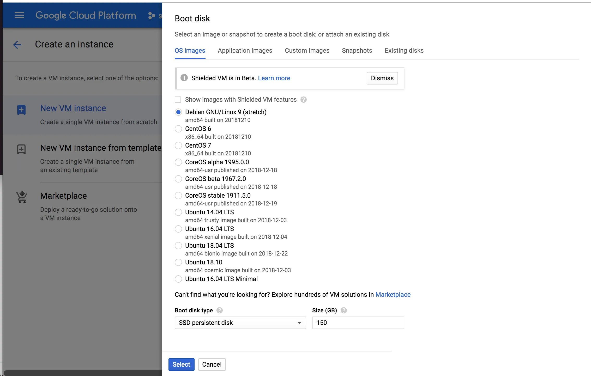
    <figcaption>VM boot disk</figcaption>
</figure>

Optional

   1. Click on the `Management, security, disks, networking, sole tenancy` link

   <figure>
       
       <figcaption>VM Management, security, disks, networking, sole tenancy</figcaption>
   </figure>

   2. Set the VM Preemptibility On. This lowers the cost but GCP can kill your instance when the resource is required for other processes.

   <figure>
       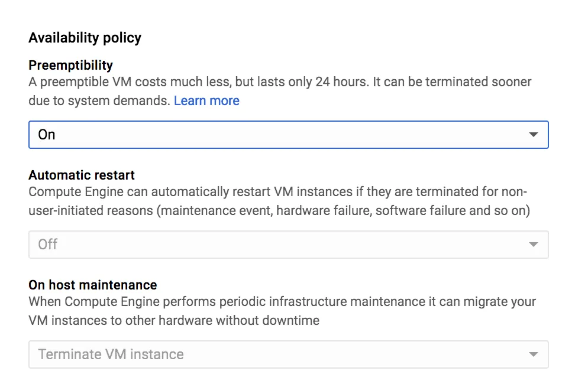
       <figcaption>VM Availability policy</figcaption>
   </figure>

6. Click on the `Create` button and your VM should be in the creation process.

<figure>
    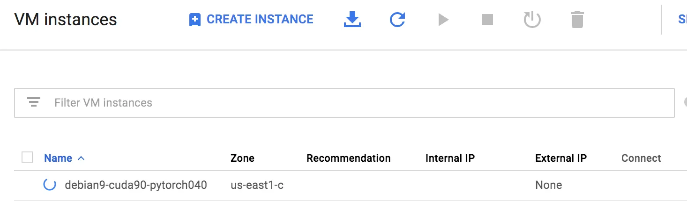
    <figcaption>VM creation processing</figcaption>
</figure>

### Install development toolchain and setup VM

1. After the VM is created, click on the `SSH` button to open a shell

<figure>
    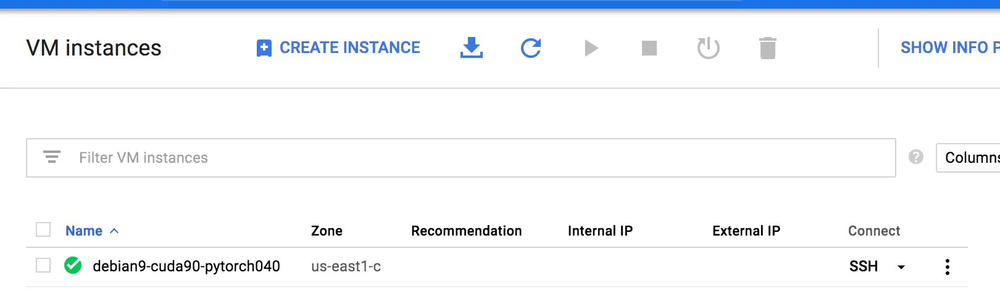
    <figcaption>VM status page and shell access</figcaption>
</figure>

2. Update apt and all packages installed in apt. `Run sudo apt update && sudo apt upgrade` in the shell

3. Install the toolchain required for building and installing the NVidia drivers and CUDA toolkit. Run `sudo apt install dkms build-essential linux-headers-$(uname -r)`

4. Create a swap file on your VM by running the following commands

```console
sudo mkdir -p /var/cache/swap/   # create a directory that holds the swap file
sudo dd if=/dev/zero of=/var/cache/swap/myswap bs=1M count=4096 # for 4 GByte
sudo chmod 0600 /var/cache/swap/myswap # only root should have access
sudo mkswap /var/cache/swap/myswap # format as swap
sudo swapon /var/cache/swap/myswap # announce to system
```

5. Add the following line to `/etc/fstab` so that the swap will get loaded upon system startup

```console
/var/cache/swap/myswap    none    swap    sw    0   0
```

### Install NVIDIA drivers and CUDA Tool kit

1. Transfer all the files obtained from the NVIDIA developer site to the VM instance. There are multiple methods that can be found at `https://cloud.google.com/compute/docs/instances/transfer-files`

2. In a shell on the GCP VM, allow the files transferred in 1 to be executed by running `sudo chmod a+x cuda_9.1.85*` in the folder containing the files.

3. In the folder containing the NVIDIA files run `sudo ./cuda_9.1.85_387.26_linux.run`. Accept the EULA and answer Yes to all the questions to install the driver, OpenGL, CUDA, code samples, etc, etc.

<figure>
    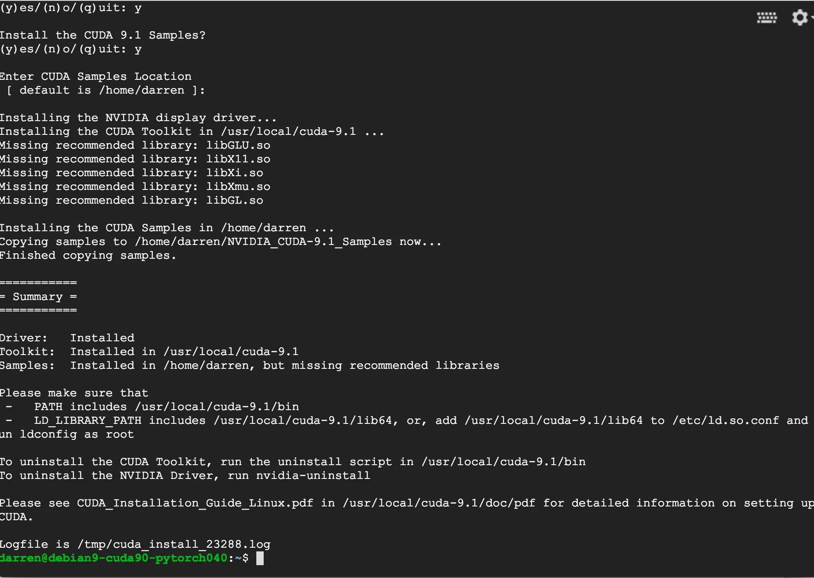
    <figcaption>VM installing NVIDIA devices and CUDA toolkit</figcaption>
</figure>

4. In the same folder run the patches accepting the EULA and installing it in the folder the base install was done. The commands are as follows:
    1. `sudo ./cuda_9.1.85.1_linux.run`
    2. `sudo ./cuda_9.1.85.2_linux.run`
    3. `sudo ./cuda_9.1.85.1_linux.run`

5. Test the NVIDIA driver and CUDA installation by going into the folder `[Samples installation folder]/0_Simple/vectorAdd/`. Run the following commands
    i. `make`
    ii. `./vectorAdd`
There should be a `Test Passed` output message

<figure>
    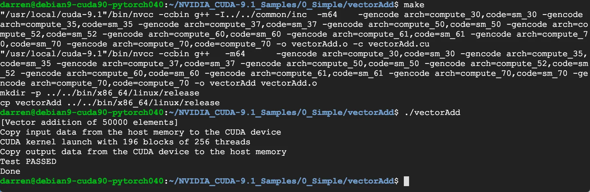
    <figcaption>VM compile and run CUDA test code</figcaption>
</figure>

### Install Pip, PyTorch and other Deep Learning Python packages

1. Install Pip3 for Python 3 by running the following command `sudo apt install python3-pip` in a shell on the VM. Verify that the installation is complete by running `pip3 —-version`

2. Install Prerequisites for PyTorch by running `pip3 install numpy`

3. Install the specific PyTorch version you require by running `pip3 install [URL to version]`. This article uses PyTorch 0.4.0 on Cuda 9.1 which resulted in a command like `pip3 install http://download.pytorch.org/whl/cu91/torch-0.4.0-cp35-cp35m-linux_x86_64.whl`

4. Install torchvision which contains the pretrained models and general datasets that can be used for Deep Learning by running `pip3 install torchvision`. The list of previous versions of PyTorch can be found at `https://pytorch.org/get-started/previous-versions/`

5. PyTorch should be installed now and to test run `python3` in your console. Then run the following code block which should print a randomly generated tensor. Exit the Python console

```python
import torch
x = torch.rand(5, 3)
print(x)
```

### Install and Setup Jupyter Notebook
1. Install Jupyter by running the following command `python3 -m pip install jupyter`.
> Note: The article skips the pip update command as it was causing an issue at the time of writing

2. Setup configuration for Jupyter Notebook by running `jupyter notebook — generate-config .`

> Note: This will impact all kernels on the VM for Jupyter Notebook. For the purpose of this article it works fine. For some of the settings in other use case you might need to customize the specific kernel like ipython. To learn more on the topic search for `matplotlib-configuration-for-inline-backend-in-jupyter-notebook`

3. Edit `/home/[username]/.jupyter/jupyter_notbook_config.py`

4. Add the following configuration

```python
c = get_config()                # get the config object for Jupyter
c.IPKernelApp.pylab = 'inline'  # Render figures inline when using Matplotlib. Depending on use case this might be on the specific kernel or it could be inline on your code
c.NotebookApp.open_browser = False  # Since we are running Jupyter Notebook on a console in the VM. Disable the setting to open a browser when Jupyter Notebook is starting
```

### Enable SSH Port Forwarding into VM
1. Create an ssh key for use during the SSH Port Forwarding. The following command is used to create the private/public key pair using defaults except for the comment (this shows up as the username), destination and passphrase on MacOS with `ssh-keygen`

```console
ssh-keygen -C username -f ~/.ssh/gcp_demo -P SECURE_PASSPHRASE
# -C shows up as the username on the VM
# -f file path to save the private and public keys on your execution host
# -P Passphrase used to protect your private key
```

2. On your GCP console add the key on the VM. Go to `Compute Engine -> VM Instances` and click on the name of your VM in the list of the VMS. As an example show below click on `debian9-cuda90-pytorch040`

<figure>
    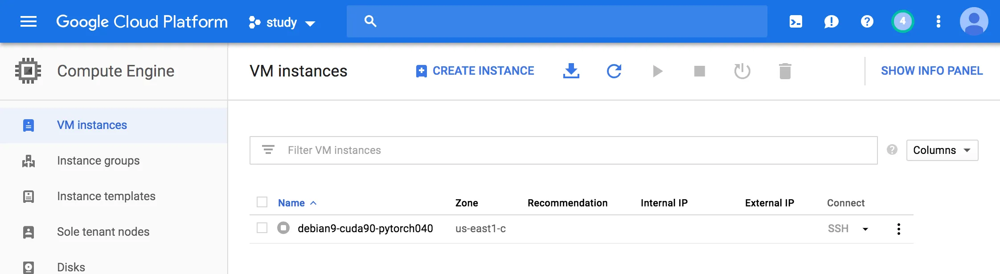
    <figcaption>VM Instances</figcaption>
</figure>

3. In the VM Details screen click on the `Edit` button

<figure>
    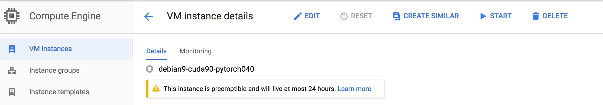
    <figcaption>VM Details</figcaption>
</figure>

4. Then go to the SSH Keys section and click on `Show and edit` link


5. Copy all the text found in the public key file of that was created in step 1. (Example in this article the file should be `~/.ssh/gcp_demo.pub`) . Paste it into the textbox for the key

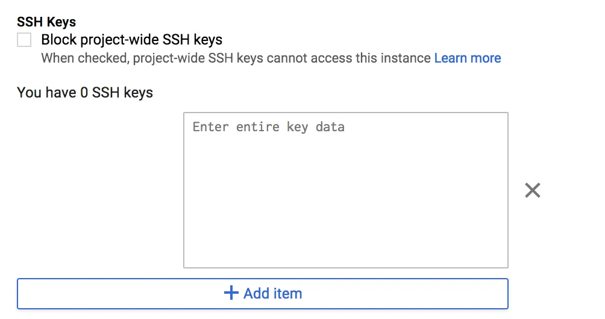

### Running Jupyter Notebook
1. Go to the folder containing the code that you wish to run in the VM Shell. Then run `jupyter notebook`

<figure>
    
    <figcaption>VM start Jupyter Notebook</figcaption>
</figure>

2. In your host console `run ssh -i ~/.ssh/gcp_demo -N -L localhost:8888:localhost:8888 -l username [External IP of VM]` to setup the SSH Port Forwarding from your host to the VM. The external IP of your VM can be obtained from the GCP console.

3. Copy the token from the VM console that your started Jupyter and access the URL that looks like `http://localhost:[port]/?token=[token]`

4. You should be able to run Jupyter Notebook from the browser with access to the files in the directory that `jupyter notebook` was started.


<figure>
    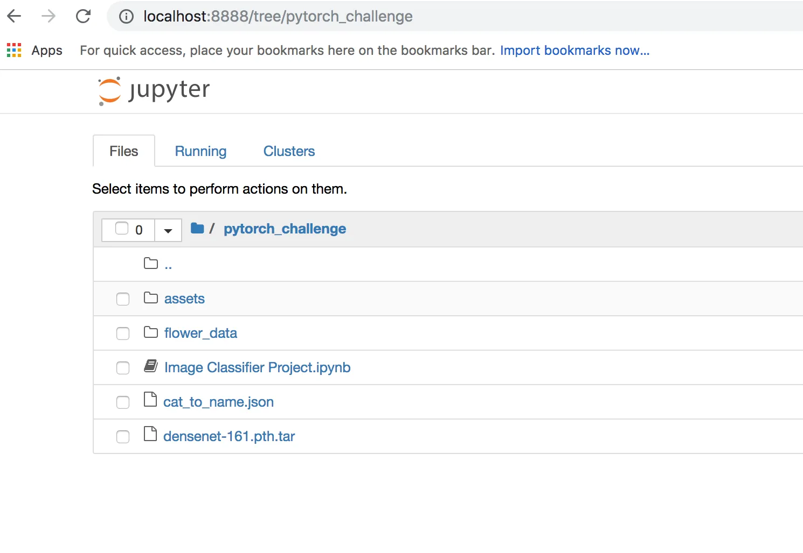
    <figcaption>Jupyter in the Browser</figcaption>
</figure>

### Conclusion

This article looks into setting up specific version of PyTorch on a GCP VM for Deep Learning using opinionated settings that serve a specific use case. It is not production harden although most of the setup steps can be use as a base for setting up a Deep Learning training VM.

> **Important Note: Remember to turn off your VM when it is not in use since use of GCP resources are chargeable and usually not in the Free Tier. Especially since the GPU has a pretty high charge. The use of SSD in this article also incurs a charge when the VM is off.**
