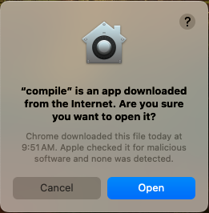
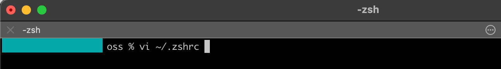

## Go for Go:  A DIY Guide to Compiling Go on macOS
> 	**Background:** Discover a secret technique for compiling #Go on #macOS! ✨ While the official [documentation](https://go.dev/doc/install/source) mentions it, this method often gets lost in the vast amount of information. Inspired by the [Atlanta Go User Group](https://www.meetup.com/go-users-group-atlanta/) meetup on the [Exploring New Rangefunc Experiment
](https://www.meetup.com/go-users-group-atlanta/events/303622741), I wanted to truly understand Go. So, I dug deeper and found a way to build it from source – without any installations. This approach keeps your system clean, allows for effortless version switching, and gives you a deeper understanding of the language. This guide demystifies the process, offering a clear path and solutions to common macOS hiccups.

*Prerequisites:* To follow along, you'll need `Git` installed on your system.  While familiarity with `Git` commands is helpful, it's not strictly required for this installation process. Optionally, having `curl` or `wget` can be useful for downloading files.

### Introduction

Ready to build Go from the ground up? Installing Go from source allows you to peek under the hood and gain a deeper understanding of how this powerful language works. While there are a few ways to achieve this, we'll focus on the most straightforward method: bootstrapping from a binary release.  This involves five main steps: acquiring the binary release, cloning the source code, compiling Go, configuring your environment, and verifying the installation.  Let's dive in and get our hands dirty!

#### Acquiring the binary release

Before we can build Go from source, we need a special ingredient: a Go compiler! Think of it as needing an oven to bake a cake. So let's head to the official Go Website to obtain the binary. 

1. **Get the binary:** Head to the official Go downloads page [here](https://go.dev/dl/). You'll find pre-compiled Go binaries for various systems. Since we're on a MacBook M1, we'll use the go1.23.2.darwin-arm64.tar.gz archive. This gives us a ready-to-use Go toolchain.
2. **Why the archive?:** We're choosing the `.tar.gz` archive over the `.pkg` installer prevent installation of Go into the system wide folders and maintain a clean setup.
3. **Get ready to download:** To avoid extra steps and potential interruptions from macOS security prompts, we'll use `curl` to download the Go archive. This method provides a smoother, more efficient compilation experience. Copy the URL for the `tar.gz` file from the Go downloads page, as we'll need it for the curl command.

<figure>
    
    <figcaption>Copying the download URL</figcaption>
</figure>

4. **Downloading the binary:** Open up your terminal and navigate to the folder you want to place the binary. Then run the command below to download the url from the Go downloads page.

```bash
    # `-O`: curl option to write output to a file named as the remote file
    # `-L`: curl option  to follow redirects
    curl -OL https://go.dev/dl/go1.23.2.darwin-arm64.tar.gz
```

5. **Extracting the archive:** Now, let's extract the files from the downloaded archive. In your terminal, run the command below:

``` bash
tar -xzf go1.23.2.darwin-arm64.tar.gz 
```

6. **Verify:** Once the extraction is complete, type `ls` in your terminal. You should see a new folder named `go`.

<figure>
    
    <figcaption>Downloading and extracting the Go binaries from the archive.</figcaption>
</figure>

#### Cloning the source code

Time to grab the Go source code! It's all hosted on GitHub. Head over to the official Go repository [here](https://github.com/golang/go) to get it.

1. **Get ready to clone:** Locate the green `Code` button on the GitHub repository page.  Clicking it will open a dialog with options for cloning the repository.

<figure>
    
    <figcaption>Go's GitHub repository</figcaption>
</figure>

2. **Getting the SSH URL for Cloning:** Switch to the `SSH` tab in the dialog box. You'll see a button with a `clipboard` icon – click it to copy the `SSH` URL. (This article uses `SSH` to clone the Go repository. If you haven't set up `SSH` keys with your GitHub account, use the `HTTPS` URL instead. You can find it in the `Code` dialog box on the `HTTPS` tab.)

<figure>
    
    <figcaption>SSH Tab in the Code Clone Dialog</figcaption>
</figure>
<details>
    <summary>
        Getting the HTTPS URL for Cloning
    </summary>
    <figure>
        
        <figcaption>HTTPS Tab in the Code Clone Dialog</figcaption>
    </figure>  
</details>

3. **Cloning the Go Repository with Git:** Open up a terminal and navigate to the folder to clone the repository. Then run the command

```bash
git clone git@github.com:golang/go.git
```
or use the following command for `HTTPS`

```
git clone https://github.com/golang/go.git
```

<figure>
    
    <figcaption>Cloning with SSH</figcaption>
</figure>

4. **Verify:**  Once the cloning is complete, type `ls` in your terminal. You should see a new folder named `go`.


<figure>
    
    <figcaption>Go source code cloned to the go folder.</figcaption>
</figure>

#### Compiling Go

Now comes the exciting part: building Go from its source code.  The Go source code is constantly evolving, with new features and bug fixes being added regularly. To ensure we're working with a stable and well-defined version, we'll use a specific tagged release for this compilation process.

1. **Targeting a Release:** Time to pick a Go version to build!  Open your terminal, go to the `go` directory, and run these commands. The first one shows you the available releases (called "tags"). The second one selects version go1.23.2 for compilation. Feel free to choose a different tag if you prefer.


```bash
git tag --list "go1.23*" # go1.23 is latest version at time of writing
git checkout tags/go1.23.2
```

<figure>
    
    <figcaption>Selecting the latest Go tag</figcaption>
</figure>

2. **Executing the Build:** Almost there! Open your terminal, navigate to the `src` directory, run the command below. Remember to set the value of `GOROOT_BOOTSTRAP` to the folder housing the binaries download in [Acquiring the binary release](#acquiring-the-binary-release)

```bash
cd src
GOROOT_BOOTSTRAP=[Path to Go binary] ./all.bash
```

<figure>
    
    <figcaption>Building Go from source</figcaption>
</figure>

3. **Build Process Finished:** Fingers crossed! The build process will take a few minutes. Once it's finished, you should see a message indicating that all tests have passed, and your Go binary is ready.

<figure>
    
    <figcaption>Go compilation completed</figcaption>
</figure>

<details>
    <summary>
        macOS Quirks: Browser-Downloaded Go Binaries and GOROOT_BOOTSTRAP
    </summary>
    macOS has security measures in place to protect your system. When running `./all.bash`, you might see multiple warnings about the Go binaries you downloaded. This is because the script uses various binaries during the build process. Each time a warning appears, simply click "Open" to allow the binary to run. If the process fails at any point, try running `./all.bash` again.
    <table style='border: 0; border-collapse:collapse;'>
        <tr>
            <td>
                <figure>
                    
                    <figcaption>Warning prompt for go binary</figcaption>
                </figure>  
            </td>
            <td>
                <figure>
                    
                    <figcaption>Warning prompt for compile binary</figcaption>
                </figure>  
            </td>
        </tr>
        <tr>    
            <td>
                <figure>
                    
                    <figcaption>Warning prompt for asm binary</figcaption>
                </figure>  
            </td>
            <td>
                <figure>
                    
                    <figcaption>Warning prompt for link binary</figcaption>
                </figure>  
            </td>            
        </tr>
        <tr>
            <td colspan="2">
                <figure>
                    
                    <figcaption>Rerunning all.bash</figcaption>
                </figure>              
            </td>
        </tr>
    </table>
</details>

### Configuring your environment

1. **Setting Up Your Shell:** To use the new Go compiler, we need to adjust your shell's settings. On newer macOS versions, this means editing the .zshrc file. Open your terminal and run this command:

```bash
vi .zshrc
```

<figure>
    
    <figcaption>Editing .zshrc</figcaption>
</figure>

2. **Enabling Go Everywhere:** To use the `go` command without having to specify its full path every time, we need to add its location to the PATH environment variable. This variable tells your shell where to look for executable files.

<figure>
    
    <figcaption>Add Go to PATH environment variable</figcaption>
</figure>

### Verifying the installation

1. **Unveiling Your New Go Compiler:** Where did our shiny new Go compiler end up? Let's find out! Open a terminal and run the commands below to reveal its location and version.

```
go version
which go
```

<figure>
    
    <figcaption>Inspecting the Go environment</figcaption>
</figure>

2. **Taking Go for a Spin:** Time for the final test! Let's make sure our Go compiler is working as expected. Create a simple Go program named `hello.go` using the following command and code:

```bash
vi hello.go
```

```go
package main

import "fmt"

func main() {
	fmt.Printf("hello, Golang\n")
}
```

3. **Running Your First Go Code:** It's time to put our newly compiled Go compiler to the test.  Navigate to the directory containing the `hello.go` file we created earlier, and run the following command in your terminal.

```bash
go run hello.go
```

<figure>
    
    <figcaption>hello.go in action</figcaption>
</figure>

### Maintaining your installation

Be aware that macOS upgrades sometimes affect the tools used to build software. This can lead to unexpected problems with your installation, such as the Go compiler failing. If you experience issues after a macOS upgrade, recompiling Go from scratch is recommended. You can find the steps to do this in the ["Compiling Go"](#compiling-go) section.

### Conclusion

You've now mastered the art of building Go from source!  We encourage you to explore the Go source code, experiment with different build options, and share your knowledge with others.  The Go community thrives on collaboration and knowledge sharing.

> Note: This article was last updated in October 2024.  While I strive to keep the information current, things can change! If you spot any broken links or outdated instructions, please let me know in the comments. Your feedback is invaluable in keeping this guide useful for everyone.  (Please bear with me, as I may not be able to respond immediately.)