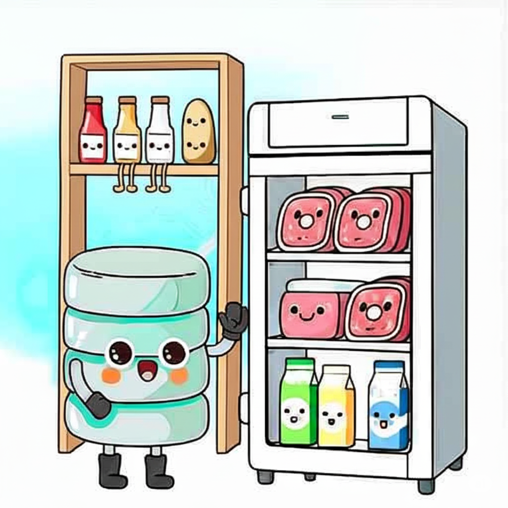
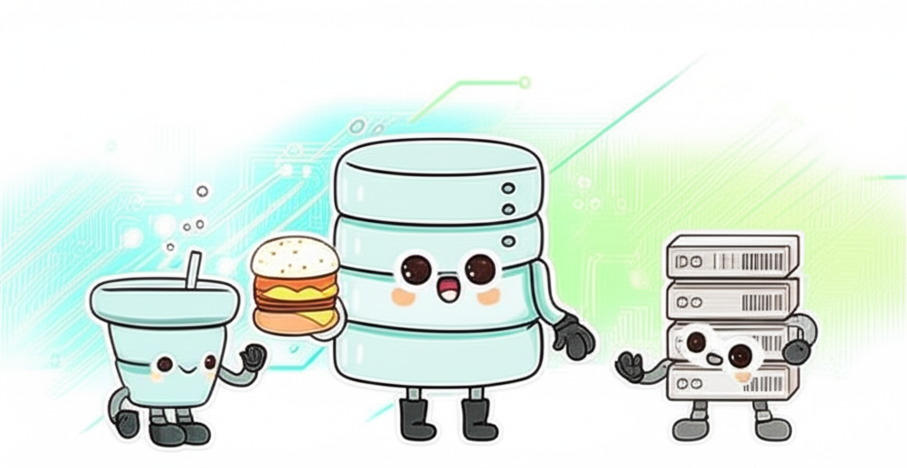
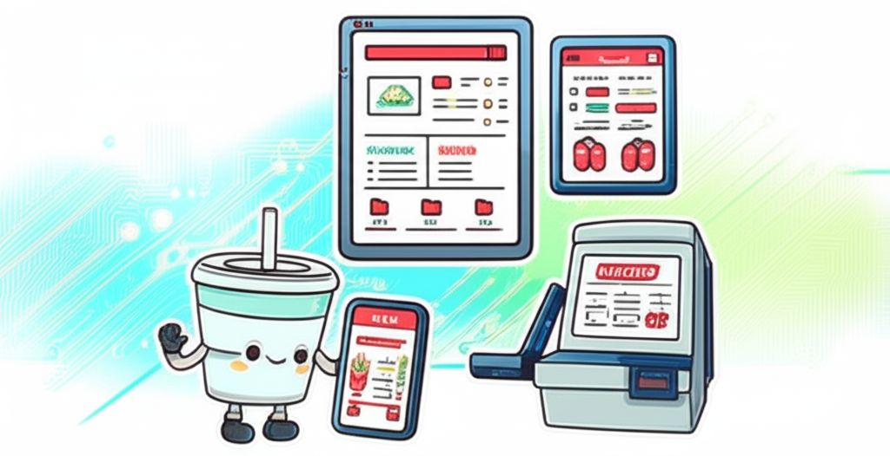

## Your Digital Fast Food Fix: How Tech Serves It Up! 😋

Ever hit up your favorite app or website and wonder how it just knows what you want? Well, it's not magic, but it is pretty smart! We're going to break down the tech behind it all, using a place we all know and love: a bustling fast-food restaurant. Get ready to understand some super cool concepts!

### The Restaurant's Treasure Trove: Databases 📦

So, imagine your go-to burger joint. Where do they keep all the good stuff before it magically turns into your meal? I'm talking juicy meat patties, fluffy buns, fresh veggies, milk for those shakes, and those potatoes waiting to become golden fries. They're all chilling in the **storage area**, right? Think giant freezers, fridges, and shelves, all neatly organized. 

Here's the lowdown on how this is like tech:
- **The Big Picture:** This storage area? That's our **database** in the tech world. It's a highly organized digital vault where all the information (our raw ingredients!) lives.
- **Inside the Vault:** Picture it like a bunch of digital tables. One table might store details about "meat patties" (like customer names and emails). Another could hold info about "buns" (like product descriptions and prices). It's all about keeping things shipshape and easy to find!
- **Why It's Important:** Just like a disorganized pantry would mean a long wait for your food, a well-structured **database** lets computers find the information they need in a flash. Fast access to data means fast service for you!

### The Super Staff: REST API 🧑‍🍳

Now, you place your order, right? Who makes that happen? The awesome **restaurant staff**! They take your wishes, dash to the storage (our **database**!) to grab the goods, then get busy in the kitchen. They're grilling those patties, toasting buns, turning potatoes into golden fries, and assembling everything into a delicious meal. Then, they hand over your completed order. 

Here's the tech translation:
- **Who They Are:** In tech-speak, this amazing staff is our **REST API**. **API** stands for **Application Programming Interface**, and it's a set of rules that lets different software programs talk to each other. **REST (Representational State Transfer)** is a common way these rules are structured for web services.
- **Their Job Description:** Think of the **REST API** as the super-efficient digital middleman. When you tap or click something, the REST API hears your request. It fetches what's needed from the **database**, tells the "backend" (that's the kitchen, where the heavy lifting happens!) what to prepare, and then sends the finished information (like your order confirmation or a new webpage) right back to you.
- **The Gist:** The **REST API** is like the polite and efficient waiter and the skilled chef, all rolled into one digital package. They ensure your order gets processed and delivered smoothly!

### Your Order Window: Front Ends 📱💻🍔

Finally, how do you actually tell the restaurant what you want? You've got options, right? Maybe you're tapping away on the **restaurant's website** on your computer. Or swiping through the **mobile app** on your phone. Perhaps you're using the **touchscreen kiosk** inside the store. Or hey, even just chatting with a **staff member at the counter**, or speaking into the **drive-through speaker**.  

And here's the tech side of things:
- **What They Are:** All these different ways you interact with the restaurant to place your order? Those are our **front ends** in the tech universe.
- **Their Purpose:** The **front end** is literally what you see and interact with. It's the colorful buttons, the sleek design, the cool animations – everything that makes using an app or website a breeze for you.
- **The Connection:** Here's the kicker: no matter if you're tapping on a screen or talking to a person, all these different **front ends** communicate with the same **REST API** (our super staff!). They're just different windows into the same fast-food magic, getting their information from the same **database** (the pantry!). So, pick your preference – website, app, kiosk – it all connects!

### Conclusion

So there you have it! **Databases** are our well-stocked pantries, **REST APIs** are the efficient staff making everything happen, and **front ends** are all the cool ways you can place your order in the exciting world of technology. Pretty neat, right? Now you've got a solid understanding of how a lot of your favorite digital services work!